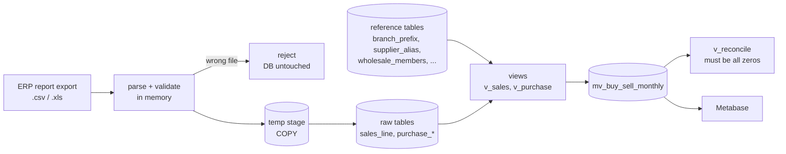

# pos-sales-etl-demo

Import messy Thai POS / ERP report exports into PostgreSQL, and prove — to the satang —
that "sale in vs sale out" reports tie back to the source files.

> **About this repo.** It is a clean-room rebuild of a pipeline I built and run at work for a
> multi-company pet-supply retailer (PostgreSQL + Node.js + Metabase). No company code or data
> is included: every file, company, supplier and number here is fictional and generated by
> `scripts/generate-samples.js`. The *problems* are real — see [docs/CASE-STUDIES.md](docs/CASE-STUDIES.md).


---

## The problem

Management wanted to see, per supplier, *what we bought vs what we sold* — weekly and monthly,
by channel and branch — to spot over-buying early and plan payments.

The only data source was the ERP's **printable report exports**, which are not tables:

- company banner and column headers repeated on every page, daily subtotal rows in between
- Buddhist-era dates (`19/08/2569`) in one file, Excel serial numbers (`46253`) in another
- multi-level purchase reports: document header → item rows → "รวม เอกสาร" total row
- document numbers that restart per company, POS-terminal prefixes that change branch over time
- the same days exported twice, files uploaded into the wrong company, the wrong report type

And the numbers had to match the ERP's own daily report **exactly**, or nobody would trust the dashboard.

## What this repo demonstrates

| | |
|---|---|
| **Parsing hostile input** | Header detection by label (survives column reordering), page-banner / subtotal skipping, document-total cross-checks |
| **Correctness over convenience** | Money summed as integer satang; dates converted time-zone-independently; every report total reconciled against raw data |
| **Fail fast, change nothing** | Wrong report type or wrong company is rejected *before* any delete/insert |
| **Idempotent loads** | `COPY` into a temp stage → delete keys present in the file → insert, in one transaction |
| **PostgreSQL** | Materialized view with a natural-key unique index → `REFRESH … CONCURRENTLY`, rules in reference tables + views (change a rule without re-importing) |
| **Tests & CI** | 22 dependency-free unit tests (`node:test`), plus a CI job that loads the samples into a real PostgreSQL and fails the build if any total is off by 0.01 |

## Quick start

Requirements: Docker, Node.js 20+.

```bash
docker compose up -d              # PostgreSQL 16 (localhost:5433) + Metabase (localhost:3000)
cp .env.example .env              # then: export $(cat .env)   (PowerShell: $env:DATABASE_URL="...")
npm install
npm test                          # 22 unit tests, no database needed
npm run import:samples            # load 5 sample exports
npm run check                     # reconcile: MV totals vs raw rows vs source files
```

Expected output of `npm run check` (abridged):

```
✔ DEMO 2026-08   sales 1,324,201.80 (diff 0.00)  purchase 2,657,058.00 (diff 0.00)
✔ DEMO2 2026-08  sales 759,642.52 (diff 0.00)  purchase 1,037,156.40 (diff 0.00)
✔ DEMO totals vs source files: ...
Reconciliation OK — every report total ties back to the source.
```

Metabase: open http://localhost:3000, add a PostgreSQL database with host `db`, port `5432`,
database/user `posdemo`, password `posdemo_local_only`, then build questions on
`mv_buy_sell_monthly` (supplier × month, retail vs wholesale, `cover_pct`).

### Try the guards

```bash
# A DEMO2 file imported as DEMO -> rejected, nothing deleted
node src/cli.js import purchase samples/purchase_DEMO2_2026-08.csv --company DEMO

# The look-alike summary report (no member column) -> rejected with an explanation
node src/cli.js import sales samples/bad/sales_summary_wrong_report.csv --company DEMO

# Re-import an overlapping export -> totals unchanged
node src/cli.js import sales samples/sales_DEMO_2026-08_part2.csv --company DEMO && npm run check
```

## Architecture



## Design decisions

- **Raw facts in, rules in views.** `sales_line` stores exactly what the file said. Branch
  (from bill prefix, scoped by company *and* date range), channel (wholesale member list) and
  supplier grouping are resolved in `v_sales` / the MV. When a POS terminal moves branch, it is
  one row in `branch_prefix` and a refresh — not a re-import.
- **Keep the rows you can't classify.** Services and unknown barcodes go to an explicit
  `(unassigned)` supplier bucket instead of being dropped by an inner join. That is what makes
  the totals reconcilable.
- **Reconciliation is a test, not a meeting.** `v_reconcile` compares raw totals with the
  reporting layer per company × month; `npm run check` fails CI on any non-zero diff.
- **Composite keys where the source reuses numbers.** Purchase documents are keyed by
  `(company, doc_no)`; lines follow via `ON DELETE CASCADE`.
- **Unique index on the MV's natural key**, not on a `ROW_NUMBER()` id: it enables
  `REFRESH … CONCURRENTLY` (dashboards keep reading during refresh) and makes duplicate rows impossible.
- **Excel files are optional.** `.csv` needs nothing; `.xls/.xlsx` use SheetJS from the official
  CDN tarball, because the `xlsx` package on the npm registry is an old build with published advisories.

## Working with AI

I build with an AI assistant and treat its output like a pull request from a fast junior:
nothing ships until it passes a check I trust. In this project that check is reconciliation.
One example from production: an AI-written view joined a flags table with
`ON f.code = a OR f.code = b`; when both codes were flagged, rows doubled. The reconciliation
query caught 27 mismatched company-months before anyone saw the dashboard; the fix (`EXISTS`
instead of a join) is in `db/03_views.sql`, and the comment explains why.

## Layout

```
db/01_schema.sql      tables (raw facts + reference data + import_log)
db/02_seed.sql        fictional companies, suppliers, products, branch map
db/03_views.sql       v_sales, v_purchase, mv_buy_sell_monthly, v_reconcile, v_dq_issues
src/dates.js          Excel serial / Buddhist-era / LMT-safe date handling
src/csv.js            dependency-free CSV parser
src/parsers/          sales + purchase report parsers, wrong-company guard
src/load.js           transactional COPY loader, idempotent re-import
src/cli.js            import | refresh | check
scripts/              deterministic sample generator
test/                 node:test suites (run without a database)
docs/CASE-STUDIES.md  the production incidents behind each design decision
```

## สรุปภาษาไทย

โปรเจกต์ตัวอย่างนี้เขียนขึ้นใหม่ทั้งหมดจากงานจริงที่ผมทำ คือนำไฟล์รายงานที่ export จากระบบ ERP/POS
เข้า PostgreSQL แล้วทำรายงานซื้อเข้าเทียบขายออกใน Metabase โดยยอดต้องตรงกับรายงานต้นทางทุกสตางค์
ข้อมูลทั้งหมดในนี้เป็นข้อมูลสมมติ ไม่มีโค้ดหรือข้อมูลของบริษัท

จุดที่อยากให้ดู: การรับมือไฟล์รายงานที่ไม่ใช่ตาราง (หัวกระดาษซ้ำ แถวรวม วันที่ พ.ศ./Excel serial),
ตัวกันอัปโหลดผิดไฟล์/ผิดบริษัทก่อนแตะฐานข้อมูล, การโหลดซ้ำได้โดยไม่เกิดยอดซ้ำ,
Materialized View ที่ refresh แบบไม่บล็อก, และการกระทบยอดอัตโนมัติใน CI

## License

MIT
